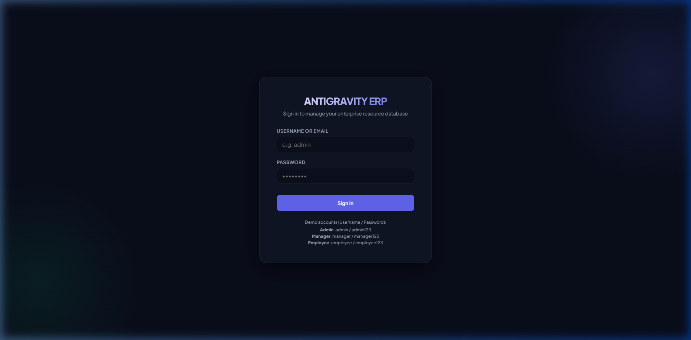
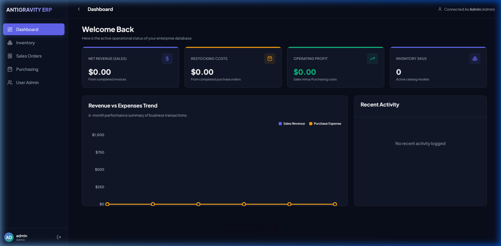
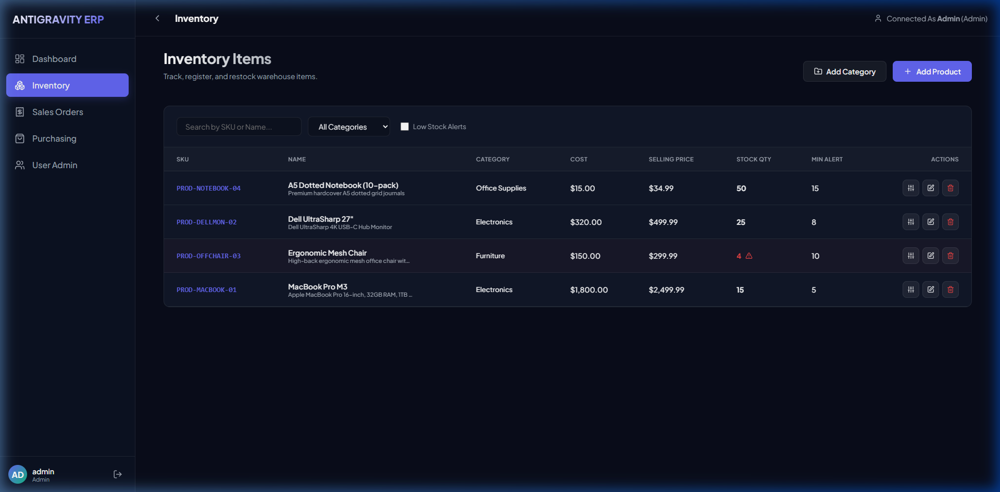
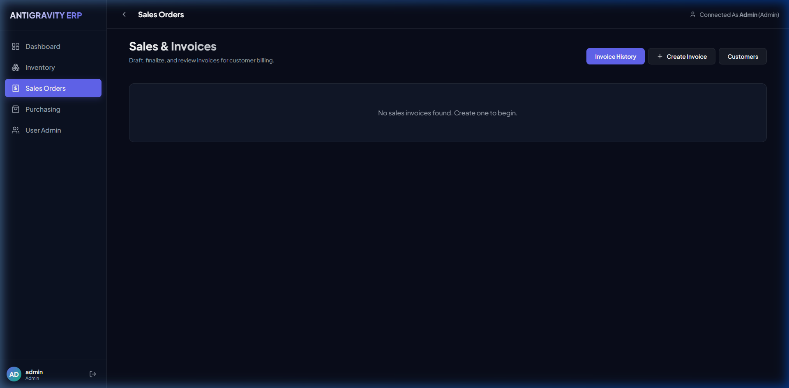

# Advance ERP System

A complete Enterprise Resource Planning (ERP) System built with Node.js + Sequelize ORM + PostgreSQL on the backend and React + Redux Toolkit + Vanilla CSS on the frontend.

## Key Modules & Features
- **User Authentication**: Secure JWT-based session management and Role-based Access Control (Roles: `admin`, `manager`, `employee`).
- **Inventory/Warehouse Management**: Full CRUD for products and categories. Includes warnings for low stock levels, stock transactions audit logging, and manual stock reconciliation.
- **Sales Orders & Invoicing**: Client registration, status-driven invoicing (Draft, Pending, Paid, Shipped, Cancelled). Moving an invoice to **Paid/Shipped** automatically checks stock and decrements warehouse levels; transitioning to **Cancelled** restores stock.
- **Purchase Orders (Restocking)**: Supplier registration, restocking order checkout. Transitioning a PO status to **Received** increments inventory levels.
- **Interactive Analytics Dashboard**: Total revenue cards, expense counters, operating profit tracking, low stock notifications, combined recent transactions feed, and an interactive dual-line area chart rendering sales vs. purchase trends.

---

## User Interface Showcase

Here are screenshots of the ERP client interfaces, illustrating the premium dark theme and dashboard grids.

### 1. Secure Access Portal
The login screen features glassmorphic layouts, error banners, and credential hints for validation testing.


### 2. Operational Analytics Dashboard
Central control panel aggregating sales revenues, restocking costs, operating profits, and stock deficit warning tiles. Includes interactive custom SVG area curves plotting monthly business trends.


### 3. Inventory Catalog & Warehouse Control
The index display tracks product SKUs, minimum stock alert warning triggers, category filtering selectors, and modal shortcuts for manual quantity reconciliations.


### 4. Invoice Builder & Sales History
A structured Invoice Builder supporting client selections, live stock catalog lookup selectors, subtotal checkout calculations, and print-ready document modals.


---

## Technical Stack & Architecture

### Backend (`/backend`)
- **Core**: Node.js, Express.js (Layered MVC architecture)
- **Database ORM**: Sequelize ORM linking with PostgreSQL
- **Security**: Password hashing using `bcryptjs` and session tokens using `jsonwebtoken`
- **Utility**: Auto-create database check on startup, connection pooling, and auto-seeding

### Frontend (`/frontend`)
- **Build Engine**: Vite + React
- **State Management**: Redux Toolkit (auth, inventory, sales, purchase, dashboard slices)
- **Routing**: React Router DOM (protected layout gates, role restrictions)
- **Theme & Design**: Custom Premium Vanilla CSS design system. Sleek glassmorphism dashboards, glowing alerts, interactive SVG custom charts, and responsive sidebars.
- **Icons**: Lucide Icons

---

## Getting Started

### Prerequisites
- Node.js (version 24+ recommended)
- PostgreSQL server (running locally or remotely)

### Step 1: Database Credentials Configuration
Open the backend environment file located at [backend/.env](file:///d:/Projects/NodeJS/ERP_System/backend/.env) and set your database username, password, host, and port:
```env
PORT=5000
NODE_ENV=development
JWT_SECRET=super_secret_erp_token_key_2026
DB_HOST=127.0.0.1
DB_PORT=5432
DB_NAME=erp_system
DB_USER=your_postgres_username
DB_PASSWORD=your_postgres_password
```

### Step 2: Database Initialization (Auto-Checks)
The backend database layer automatically checks if the target database `erp_system` exists on startup and attempts to create it, execute migrations, and seed default values.

You can verify connection details by running the validation script:
1. Open a terminal in the root directory.
2. Run the database verification script:
   ```bash
   cd backend
   node verify_db.js
   ```

### Step 3: Run the Servers

From the root directory of the project, you can run both backend and frontend servers using root scripts:

#### Install dependencies for all workspace projects:
```bash
npm run install-all
```

#### Start the backend server (express runs on port 5000):
```bash
npm run dev-backend
```

#### Start the frontend application (Vite runs on localhost):
```bash
npm run dev-frontend
```

---

## Seeding & Demo Access
On database sync, the backend automatically seeds the system with demo accounts, categories, and products. You can log in with:

| Account Username | Password | Role |
| :--- | :--- | :--- |
| **admin** | `admin123` | Administrator (full access to users, settings, and orders) |
| **manager** | `manager123` | Manager (access to products, sales, and purchases) |
| **employee** | `employee123` | Employee (read-only catalog access, invoice checkout) |
